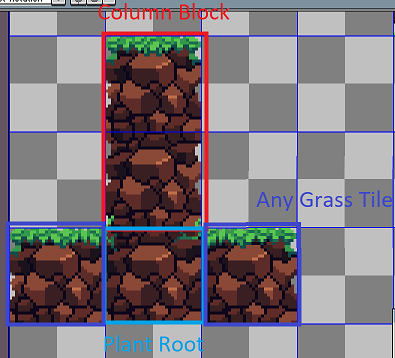
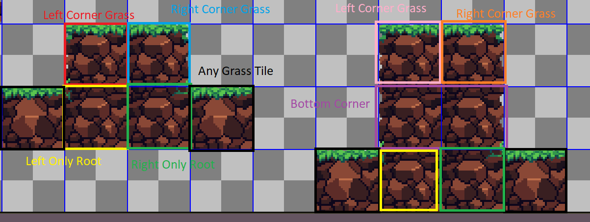
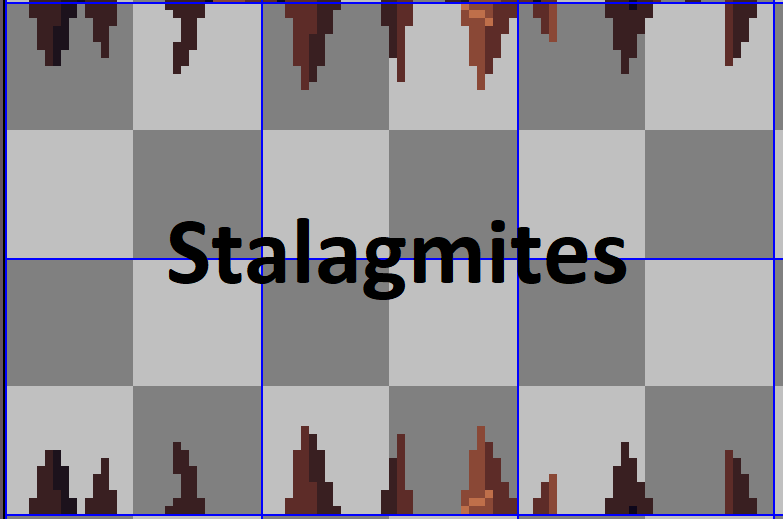
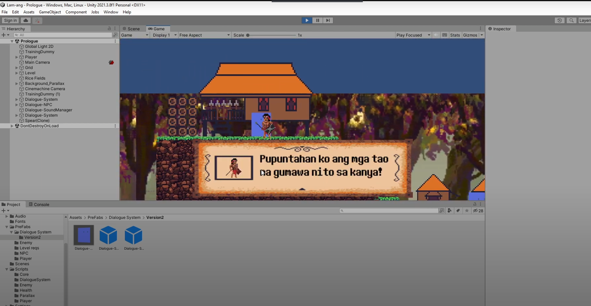

# Lam-ang 0.002 (Alpha Build)
This is the 0.002 (Alpha) Build for the game Lam-ang:tm: made by Group 8 ltd. Group 8 is a game development studio run by 4 classmates aiming for the goal of thesis completion. The company is undergoing Series A funding with a valuation of a WHOPPING 50 PHP.
 
This game is made with the Magic Circle Learning Model. The aim of this game is to use Magic Circle Learning Model to increase Grade 10 students' interest level in Ilokano folklore. The game is about the story of Biag ni Lam-ang a baby born to talk and already has a six-pack at 9 months old. This game focuses on the part where Lam-ang, a nine month old boy, travels to find his father who has yet to return.

### How to play:
Download Here: https://github.com/CookieJari/Lam-ang/releases 
Unpack the .zip file. 
Run the .exe file.  

<b>CREATED BY: </b> 
Game Director | Art Lead: Andrew 
Game Engineering Lead: Jari 
Machine Learning Lead: Keneth 
UI/UX Team Lead: Asher  

<b>Special Thanks: </b> 
Music and SFX: Neal Samuel Lerios 
Additional art: Edward Benjie Tatel 
QA Tester: Karl Melo "Arvattii" Pascua 
QA Tester: Pamangkin ni Andrew 

## Manifesting Graduation
sana graduate pliz  
"Don't think of research for what it is now, think about how it would look 2 papers down the line"  
-Dr. Károly Zsolnai-Fehér 2022

## How to use Andrew's Tilemap
### Top Soil   
There are 5 variants of soil to be used. Each variant has 3 columns and 5 rows. We have multiple variants to avoid the look of repetetiveness.
Please use different variants together when possible.

You are also given two types of grass block per variant

Labelled in the image are the columns L, M, R
L = These blocks are used on the left most part of the ground. Use this only when the block on the left is not soil and the right side is soil
M = These are the middle blocks. These are used when both sides are soil.
R = These blocks are used on the right most part of the ground. Use this only when the block on the right is not soil and the left side is not soil

### Columns

Labelled in the images are the dirt blocks to be used when making columns. Columns are used when both sides of the block are not soil.

### Corners

Here are the different types of gras that can be used on corner tiles. There are also root blocks to add a bit of greenery before reaching the grass block.

### Stalagmites

Well, self explanatory. This is used for caves.

## How to use Dialogue System
Please watch this tutorial how to work with DialogueSystem. [Dialogue System - Youtube Link](https://www.youtube.com/watch?v=c9A2Iv6cEwE)

## Inresting Dev Stories
Aug. 24, 2022
I was tryna make the script for throwing spears. I did this by instantiating the spear object and, well, this bug happened lmao.
 
(This took more than 3 hours to fix :nerd_face: :skull:

 
 
Aug. 27, 2022
LMAO another spear bug. I was trying to make its rotation follow the curve of the projectile. But obvously something went wrong.

 
 
Oct. 24, 2022
While doing some fixes on the kid, collision is still not fixed and you can still hit the kid lol

 
Dec. 2, 2022
Doing some experimenting for Lam-Ang to freeze position when he attacks, but this happened. 

 
 
# Lam-ang art evolution
Oct. 18, 2022
This image shows how Lam-ang started from a concept and became into the current Lam-ang sprite the game uses.

